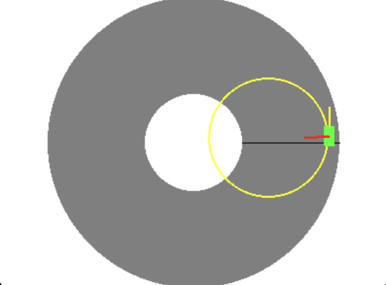

# unicycle-rl

OpenAI Gym-like RL environment based on a "unicycle racing" game that can be played [here](https://profsucrose.dev/unicycle). This repo is a simple visualizer in PyGame + a basic attempt at writing an agent

The game, taken from the website and boiled down in `environment.py`/`game.py`, is about controlling a unicycle by leaning the body of the "rider" where the angle of which determines how quickly the unicycle leans as a whole left or right. This then affects the turning radius (represented by an yellow osculating circle in the visualizer) which then determines how the unicycle moves when the rider "pedals" forward or backward. The goal is to loop around the track, ideally as quickly as possible, while staying on the track and not falling by entering the center or by exiting the loop's perimeter.

The environment is constructed by taking the physics from the game and letting an agent choose an action at each time step. This then progresses the game to the next frame and returns a reward based on what angle the agent has just displaced, which can be negative if it had just pedaled backwards/counterclockwise. For now, the agent pedaling past the finish line/0 degrees ends the episode with 0 reward. The environment is currently featurized by a vector comprising the momentum of the unicycle, lean angle, position, etc.

`pygame_test.py` runs a visualizer of the environment that can be controlled with W/S, A/D and Shift.

`train.py` trains a model, saving checkpoints to `checkpoints`.

`visualize.py` takes the latest checkpoint if there is one, loads the corresponding model, and renders an episode.

## Branches

`main` is an attempt at DQN, `vpg` is a basic implementation of a Vanilla Policy Gradient.

TODO:
 - Derivative-free algos, e.g. NEAT
 - More sophisticated policy gradient methods: PPO, DDPG, etc.
 - Actor-critic methods
 - Model-based methods, e.g. LQR, to see what it'd take to find the optimal controller analytically. To not "cheat" by leveraging the known physics of the game when having the agent learn, could try something like https://arxiv.org/abs/1708.02596

